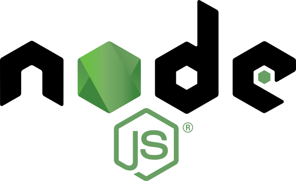

<h1 align="center"><strong>Hello World! 👋, my name is Matheus Harmmer</strong></h1>

 
 

 
 <h1 align="left">About me</h1>
 
Tenho 26 anos, moro em Curitiba no estado do Paraná, sou apaixonado por tecnologia e jogos! Vim da área da Engenharia Mecânica e estou iniciando minha transição de carreira para esse maravilhoso mundo da programação.

 
 

<table style="width:70%" align="center">
  <tr>
    <th>Languages</th>
    <th>Frameworks and Technologies</th>
    <th>Dev Tools</th>
  </tr>
  <tr>
    <th>&nbsp;&nbsp;</th>
    <th>&nbsp;&nbsp;&nbsp;&nbsp;&nbsp;&nbsp;&nbsp;&nbsp;</th>
    <th>&nbsp;&nbsp;</th>